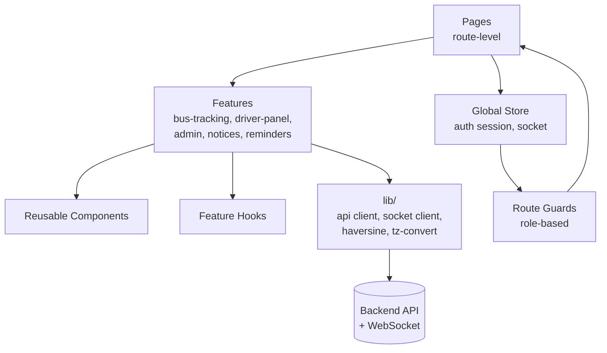
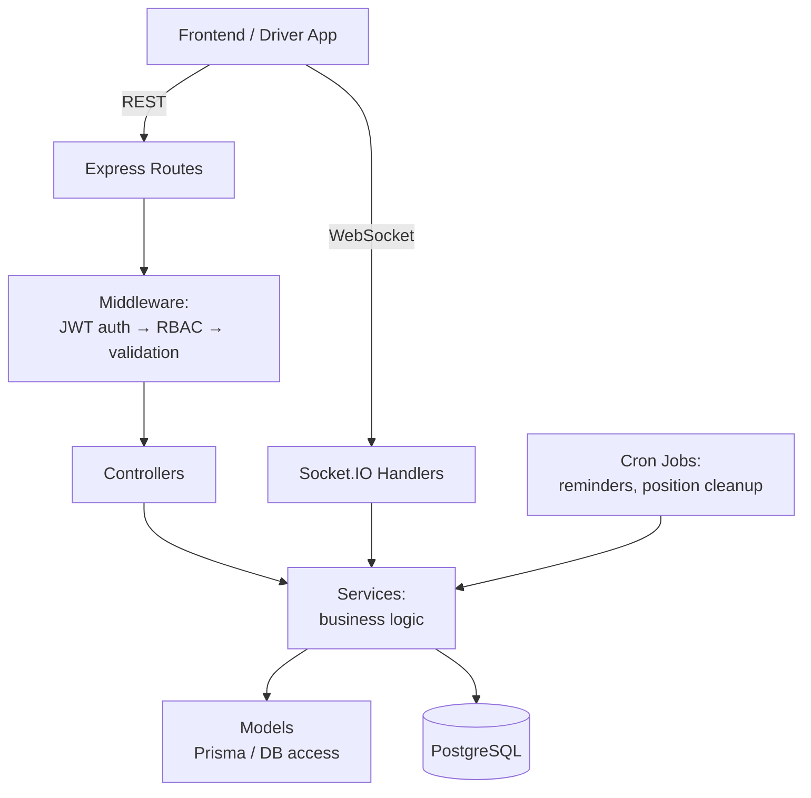
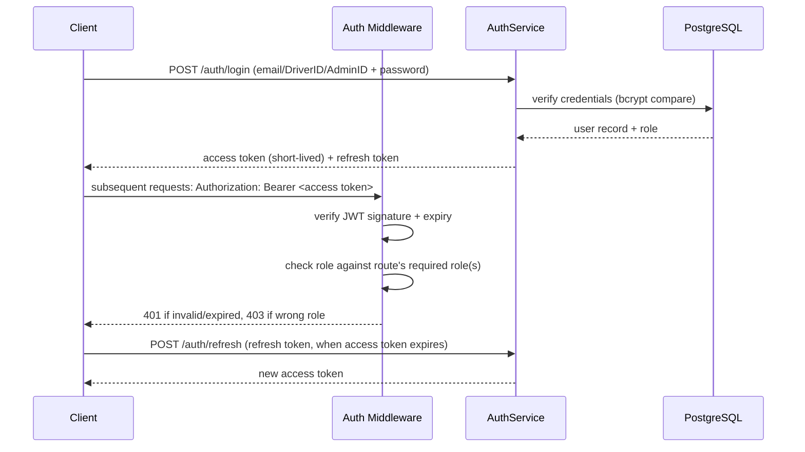
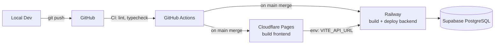

# System Architecture — BUBT Bus Tracking System

Phase 2 output. This defines _how_ the system is structured — no implementation yet. Database columns/indexes are finalized in Phase 3; API endpoint contracts in Phase 4; this document covers the shape everything fits into.

---

## 1. Folder Structure

Monorepo, three top-level areas: `apps/` (deployable units), `packages/` (shared code), `docs/` (this documentation set).

```
bubt-bus-tracking/
├── apps/
│   ├── frontend/                 # React + TS + Tailwind → Cloudflare Pages
│   │   ├── public/
│   │   │   └── service-worker.js       # Web Push handling
│   │   └── src/
│   │       ├── components/             # Reusable, presentation-only (Button, Card, Modal...)
│   │       ├── features/               # Feature-scoped: bus-tracking/, driver-panel/, admin/, notices/, reminders/
│   │       │   └── <feature>/
│   │       │       ├── components/     # Feature-specific components
│   │       │       ├── hooks/          # Feature-specific hooks
│   │       │       └── api.ts          # Feature's API calls
│   │       ├── pages/                  # Route-level screens, compose features
│   │       ├── routes/                 # Router config, route guards per role
│   │       ├── store/                  # Global state (auth session, socket connection)
│   │       ├── hooks/                  # App-wide hooks (useAuth, useGeolocation, useSocket)
│   │       ├── lib/                    # api client, socket client, haversine util, date/timezone util
│   │       ├── types/                  # Frontend-only types
│   │       └── assets/
│   │
│   └── backend/                  # Node + Express + Socket.IO → Railway
│       └── src/
│           ├── routes/                 # Express route definitions (thin, delegate to controllers)
│           ├── controllers/            # Request/response handling per resource
│           ├── services/               # Business logic (trip lifecycle, ETA calc, schedule switch)
│           ├── models/                 # Prisma models / DB access layer
│           ├── middleware/             # auth (JWT verify), RBAC, validation, rate-limit
│           ├── sockets/                # Socket.IO event handlers, room management
│           ├── jobs/                   # node-cron jobs (reminder checks, position cleanup)
│           ├── utils/                  # haversine, tel-link generator, OTP generator
│           └── config/                 # env loading, CORS config, VAPID keys
│
├── packages/
│   ├── shared-types/              # TypeScript types shared frontend ↔ backend (Trip, Bus, User, Role, etc.)
│   └── config/                    # Shared eslint/tsconfig
│
├── docs/                          # All planning docs (this set)
└── .github/workflows/             # CI: lint, typecheck, test on PR
```

**Rule enforced from `PROJECT_RULES.md`:** shared types live in `packages/shared-types`, never duplicated between frontend and backend.

---

## 2. Frontend Architecture



- **State management:** React Context + hooks for auth/session and socket connection (lightweight — no Redux needed for this scope). Feature-local state stays in feature hooks.
- **Routing:** role-based route guards — `/user/*`, `/driver/*`, `/admin/*`, each gated by the JWT's `role` claim; unauthenticated users redirected to login.
- **API layer:** a single typed `apiClient` (fetch wrapper) in `lib/`, handling auth headers, refresh-token retry-on-401, and error normalization. All feature `api.ts` files call through it — never raw `fetch` scattered in components.
- **Realtime layer:** one Socket.IO client instance in `store/`, connected once per session; features subscribe/unsubscribe to specific `trip:<id>` rooms as needed.
- **Reusable components:** Button, Card, Badge (status pill), Modal, MapView (Leaflet wrapper), Table, FormField — built once in `components/`, styled via Tailwind, used everywhere. No one-off duplicated markup.

---

## 3. Backend Architecture



**Layering rule:** Controllers never talk to the database directly — always through Services, which use Models. This keeps business logic (e.g., "what does starting a trip actually do") testable and independent of the HTTP layer, and reusable from both REST controllers and Socket.IO handlers.

**Key services (Phase 8 will implement these):**

- `AuthService` — registration, OTP generation/verification, login, token refresh, driver credential provisioning, password reset
- `TripService` — trip lifecycle (start/finish), ETA calculation (haversine), status transitions
- `ScheduleService` — schedule activation, trip regeneration from templates
- `NotificationService` — Web Push dispatch, in-app notification fallback, reminder triggers
- `TrackingService` — GPS ingestion, position persistence (debounced), room broadcast

---

## 4. Database Architecture (structural — full schema in Phase 3)

- **ORM:** Prisma, single schema file, migrations tracked in `apps/backend/prisma/migrations/`.
- **Single `users` table** with `role` enum, as confirmed — avoids join complexity for auth, keeps one login endpoint.
- **Separation of "live" vs "historical" data:** `trips` holds current/recent state; `trip_positions` holds the GPS history stream (subject to the 30-day retention job).
- **Schedule-driven generation:** `schedules` + `schedule_trip_templates` are the source of truth; `trips` rows are _generated_ from the active template, not hand-edited per day.

---

## 5. API Architecture

- **Style:** REST for all CRUD and command operations (`POST /trips/:id/start`, not just resource CRUD). Socket.IO strictly for streaming/live data (position updates, live status pushes) — not for anything that needs a confirmable request/response.
- **Versioning:** all routes prefixed `/api/v1/...` from day one, so breaking changes later don't require a big-bang migration.
- **Response envelope:** consistent shape across all endpoints —

```json
{ "success": true, "data": { ... }, "error": null }
{ "success": false, "data": null, "error": { "code": "TRIP_ALREADY_STARTED", "message": "..." } }
```

- **Error handling:** centralized Express error-handling middleware; services throw typed errors, middleware maps them to HTTP status + the envelope above. No raw stack traces reach the client.
- Full endpoint-by-endpoint contract is Phase 4's deliverable.

---

## 6. Authentication Flow



- RBAC enforced in middleware, not scattered per-controller — a route declares its required role(s) once, middleware checks it before the controller runs.
- Driver first-login forces a password-change step, enforced by a `must_change_password` flag checked in the same middleware chain.

---

## 7. Real-Time Flow

Full sequence diagram already captured in `PROJECT_OVERVIEW.md` §4. Architectural notes:

- **Room strategy:** one Socket.IO room per `trip:<trip_id>`. Driver joins/broadcasts to their own trip's room; users join the room of whatever trip they're currently viewing, and leave it when they navigate away.
- **Admin monitoring:** a separate `admin:live` room receives position updates for _all_ active trips simultaneously, for the fleet-wide dashboard view.
- **Emergency alerts:** broadcast to `admin:live` **and** a global `broadcast:all` room (confirmed: all users receive emergency alerts, not just those tracking that trip).
- **Debounced persistence:** every GPS tick is broadcast live; only every ~10th (or time-boxed) tick is written to `trip_positions`, per the retention/cost decision in Phase 0.

---

## 8. Deployment Flow



- **Environments:** `development` (local), `production` (Cloudflare Pages + Railway + Supabase). No staging environment planned for v1 given project scope — noted as a gap if this changes.
- **Secrets:** JWT signing secret, VAPID keys, DB connection string, OTP email provider credentials — all stored in Railway/Cloudflare environment variable stores, never committed.
- **Migrations:** Prisma migrations run as a Railway deploy step before the new backend version receives traffic.
- **CORS:** backend allow-list locked to the exact Cloudflare Pages production URL (per `PROJECT_RULES.md`).

---

## Phase 2 Checklist

- [x] Folder structure (frontend, backend, shared packages)
- [x] Frontend architecture (state, routing, API layer, realtime layer, reusable components)
- [x] Backend architecture (layering: routes → middleware → controllers → services → models)
- [x] Database architecture (structural approach — full schema deferred to Phase 3)
- [x] API architecture (REST conventions, versioning, response envelope, error handling)
- [x] Authentication flow (JWT + refresh + RBAC + driver forced password change)
- [x] Real-time flow (Socket.IO room strategy, admin monitoring, emergency broadcast, debounced persistence)
- [x] Deployment flow (CI/CD, environments, secrets, migrations, CORS)

No implementation performed. Waiting for approval to proceed to **Phase 3 — Database Design**.
