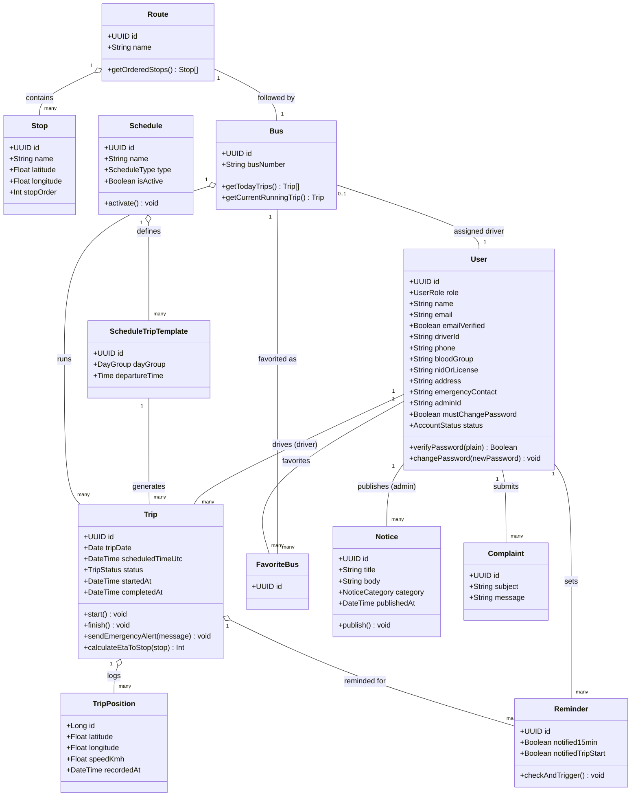
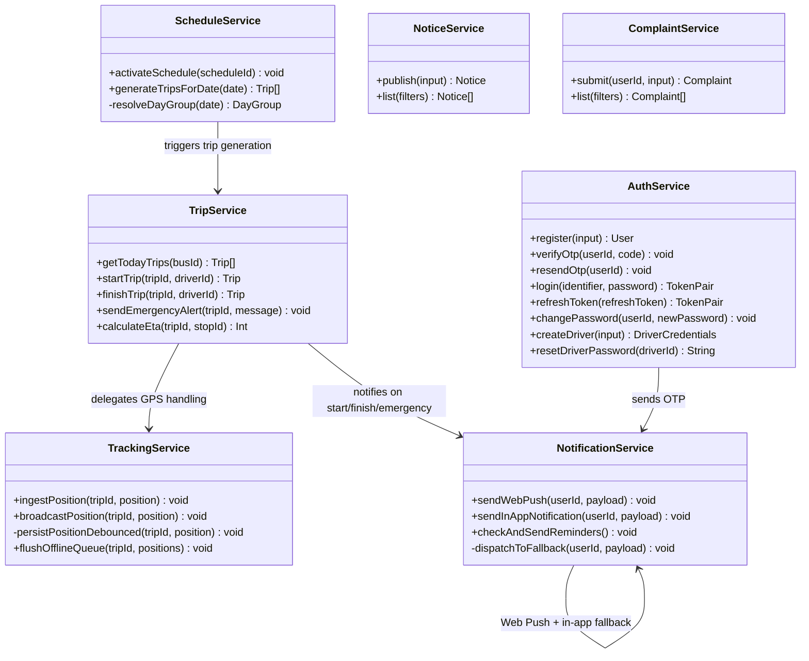

# Class Diagram — BUBT Bus Tracking System

Supplementary architecture artifact (belongs alongside `ARCHITECTURE.md`, Phase 2). Two diagrams: the **Domain Model** (entities, mirrors `schema.sql`/`DATABASE_DESIGN.md` but expressed as classes with behavior) and the **Service Layer** (the business-logic classes from `ARCHITECTURE.md` §3, and how they depend on each other).

---

## 1. Domain Model

**Note on style:** `User` is a single class (not subclassed per role) because the confirmed decision is one `users` table with a `role` enum, not separate `Student`/`Driver`/`Admin` classes — the diagram stays consistent with that choice rather than reintroducing role-based inheritance the data model deliberately avoids.

---

## 2. Service Layer

The business-logic classes from `ARCHITECTURE.md` §3 — these sit between Controllers and Models, and are what Phase 8 actually implements.

**Layering reminder (per `ARCHITECTURE.md` §3):** Controllers call Services; Services call Models (Prisma); Services never call each other's Models directly — cross-cutting behavior (like "starting a trip also sends a notification") is expressed as one Service calling another Service, as shown above, keeping each Service's own data access self-contained.

---

## Where this fits

This diagram supplements Phase 2's `ARCHITECTURE.md` (which described the layering in prose/flowcharts but didn't include a formal class diagram) and Phase 3's `DATABASE_DESIGN.md` ER diagram (which shows the same entities as *data*, not *behavior*). Added as a retroactive Phase 2 artifact — no architectural decisions changed, this only documents structure that was already implied by `ARCHITECTURE.md` §3 and the entity list in `packages/shared-types`.
