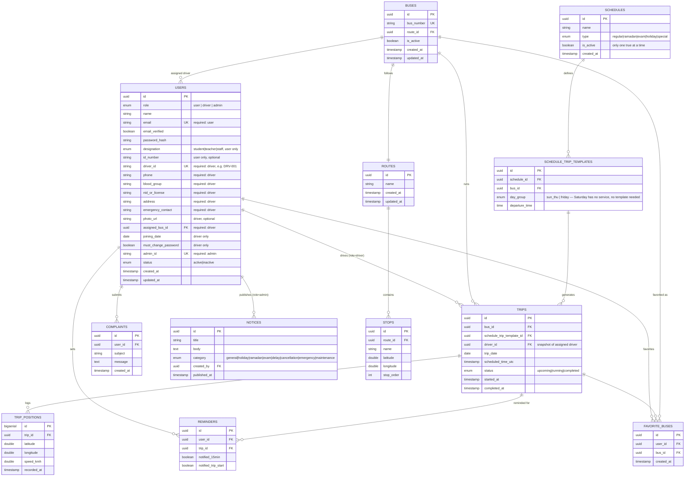

# Database Design — BUBT Bus Tracking System

Phase 3 output. PostgreSQL, accessed via Prisma in the backend. This document is the source of truth for the schema; `schema.sql` (companion file) is the runnable DDL generated from it.

---

## 1. Entity Relationship Diagram — Core Domain



*Auxiliary/support tables (`otp_codes`, `refresh_tokens`, `push_subscriptions`, `notifications`, `emergency_alerts`) are omitted from the diagram for readability — full definitions are in §2 and `schema.sql`.*

---

## 2. Table Reference

### `users`
Single table for all three roles, per the confirmed auth model. Role-specific columns are nullable and enforced by a `CHECK` constraint (see §4) rather than split into separate tables.

### `buses`
`bus_number` unique (e.g. "BUBT-01"). One route per bus (`route_id`). `is_active` added in Phase 8 — the original Phase 3 schema omitted it, but `API_DESIGN.md`'s `PATCH /admin/buses/:id/status` endpoint and the Phase 7 Admin UI both assume bus activate/deactivate exists; this closes that gap rather than working around it.

### `routes`
Just a name/label; the actual path is defined by its ordered `stops`.

### `stops`
Ordered via `stop_order` within a route. Lat/lng used both for map rendering and haversine ETA calculation.

### `schedules` / `schedule_trip_templates`
`schedules` holds the named templates (Regular, Ramadan, etc.); `schedule_trip_templates` holds each bus's departure times *within* a schedule. Only one schedule may have `is_active = true` at a time (enforced via partial unique index, §4). Activating a schedule triggers trip generation for upcoming days from its templates.

**Day-group model (confirmed against the real BUBT bus notice):** a single active schedule can define different departure times for **Sun–Thu** vs **Friday** via the `day_group` field on each template — this is a recurring weekly pattern, not a schedule switch. **Saturday has no bus service at all**; no templates are created for it, and the trip-generation job (Phase 8) simply produces zero trips for any date that falls on a Saturday. A **Holiday** schedule (e.g. Eid closure) is modeled as an active schedule with **zero templates** — meaning trip generation produces zero trips for its entire active period, matching the real notice's "all routes suspended" behavior.

### `trips`
One row per actual trip instance (a specific bus, on a specific date, at a specific time). `driver_id` is snapshotted at generation time so trip history remains accurate even if a driver's bus assignment changes later. `status` drives all UI grouping (Completed/Running/Upcoming).

### `trip_positions`
High-volume GPS history. `bigserial` PK (not UUID) since this table grows fastest and doesn't need global uniqueness guarantees. Subject to the 30-day retention purge job.

### `reminders`
One row per user-per-trip reminder. Two independent notification flags track whether each of the two reminder triggers (T-15min, trip-start) has already fired, so the cron job doesn't double-send.

### `favorite_buses`
User's personal pin — convenience only, not an assignment (per the confirmed decision). Unique per `(user_id, bus_id)`.

### `notices`
`created_by` always a `role=admin` user. `published_at` separate from `created_at` in case scheduled/delayed publishing is wanted later.

### `complaints`
Simple submission log — no status workflow, per confirmed scope.

### `otp_codes` *(auxiliary)*
```
id UUID PK, user_id FK, code_hash VARCHAR, expires_at TIMESTAMP, consumed BOOLEAN, attempt_count INT, created_at
```
Stores a *hash* of the OTP, never plaintext. `attempt_count` supports future brute-force lockout if needed.

### `refresh_tokens` *(auxiliary)*
```
id UUID PK, user_id FK, token_hash VARCHAR, expires_at TIMESTAMP, revoked BOOLEAN, created_at
```
Enables refresh token revocation (e.g. on logout or password change) rather than trusting a stateless token until natural expiry.

### `push_subscriptions` *(auxiliary)*
```
id UUID PK, user_id FK, endpoint TEXT, p256dh VARCHAR, auth VARCHAR, created_at
```
Standard Web Push subscription object fields, one row per browser/device the user has enabled push on.

### `notifications` *(auxiliary — in-app bell, iOS fallback)*
```
id UUID PK, user_id FK, type ENUM, title VARCHAR, body TEXT,
related_trip_id UUID NULL, related_notice_id UUID NULL,
is_read BOOLEAN, created_at
```

### `emergency_alerts` *(auxiliary — admin dashboard history)*
```
id UUID PK, trip_id FK, driver_id FK, message TEXT NULL, created_at
```
Log of every emergency alert sent, so Admin has a history view, not just the live broadcast.

---

## 3. Relationships Summary

| Relationship | Type |
|---|---|
| Route → Stops | one-to-many |
| Route → Bus | one-to-one (a bus has exactly one route) |
| Bus → Driver (user) | one-to-one (permanent assignment) |
| Bus → Trips | one-to-many |
| Schedule → Schedule Trip Templates | one-to-many |
| Schedule Trip Template → Trips | one-to-many (generates) |
| Trip → Trip Positions | one-to-many |
| Trip → Reminders | one-to-many |
| User → Reminders | one-to-many |
| User → Favorite Buses | one-to-many |
| User → Complaints | one-to-many |
| User (admin) → Notices | one-to-many |

---

## 4. Key Constraints

- **Only one active schedule:** `CREATE UNIQUE INDEX schedules_one_active ON schedules (is_active) WHERE is_active = true;`
- **Role-specific required fields**, enforced at the DB layer via `CHECK`:
```sql
CHECK (
  (role = 'user'  AND email IS NOT NULL) OR
  (role = 'driver' AND driver_id IS NOT NULL AND phone IS NOT NULL AND blood_group IS NOT NULL
                    AND nid_or_license IS NOT NULL AND address IS NOT NULL
                    AND emergency_contact IS NOT NULL AND assigned_bus_id IS NOT NULL) OR
  (role = 'admin' AND admin_id IS NOT NULL)
)
```
- **Partial unique indexes** (since `email`, `driver_id`, `admin_id` are all nullable but must be unique when present):
```sql
CREATE UNIQUE INDEX users_email_unique      ON users(email)      WHERE email IS NOT NULL;
CREATE UNIQUE INDEX users_driver_id_unique  ON users(driver_id)  WHERE driver_id IS NOT NULL;
CREATE UNIQUE INDEX users_admin_id_unique   ON users(admin_id)   WHERE admin_id IS NOT NULL;
```
- **One driver per bus, permanently:** `assigned_bus_id` on `users` has a unique constraint where `role = 'driver'` (a bus can't have two drivers assigned at once — reassignment requires clearing the old one first).
- **No duplicate trip per bus/time:** `UNIQUE(bus_id, scheduled_time_utc)` on `trips`.
- **No duplicate reminder:** `UNIQUE(user_id, trip_id)` on `reminders`.
- **No duplicate favorite:** `UNIQUE(user_id, bus_id)` on `favorite_buses`.
- All foreign keys `ON DELETE RESTRICT` by default (no accidental cascading data loss), except `trip_positions.trip_id` and `notifications.*` which use `ON DELETE CASCADE` (pure history/derived data tied to a parent that, if deleted, should take its children with it).

---

## 5. Indexes (performance)

| Table | Index | Purpose |
|---|---|---|
| `trips` | `(bus_id, trip_date)` | Today's Trips lookup per bus |
| `trips` | `(status)` | Filtering running/upcoming trips fleet-wide |
| `trip_positions` | `(trip_id, recorded_at DESC)` | Latest position lookup, history queries |
| `stops` | `(route_id, stop_order)` | Ordered stop rendering |
| `notices` | `(category, published_at DESC)` | Notices feed, filterable by category |
| `reminders` | `(trip_id)` | Cron job scanning upcoming trips for pending reminders |
| `schedule_trip_templates` | `(schedule_id, bus_id, day_group)` | Trip-generation job looking up the right template set for a given date |
| `otp_codes` | `(user_id, expires_at)` | Fast lookup + expiry check during verification |

---

## 6. Seed Data Plan

Run once via a seed script (`apps/backend/prisma/seed.ts`, wired up in Phase 6). Updated to reflect the **real, official BUBT bus schedule** (Registrar's notice Ref: BUBT-Reg-511-03-26).

1. **Two fixed Administrator accounts** — `admin.transport1` / `admin.transport2`, exact credentials as documented in `ACTOR_AUTH_AND_CREDENTIALS.pdf`. Passwords hashed with bcrypt before insert, never stored plaintext even in seed scripts.

2. **5 real Routes**, one per bus:

| Bus | Route |
|---|---|
| Buriganga | Asad Gate → Shyamoli → Mirpur 1 → Rainkhola → BUBT |
| Padma | Shyamoli (Shishumela) → Agargaon → Kazipara → Mirpur 10 → Proshika → BUBT |
| Meghna | Mirpur 14 → Mirpur 10 (Original) → Mirpur 11 → Proshika → BUBT |
| Jamuna | ECB Square → Kalshi Bridge → Mirpur 12 → Duaripara → BUBT |
| Brahmaputra | Nabinagar → Jahangirnagar → Savar → Hemayetpur → Aminbazar → Gabtoli → Mazar Road → Mirpur 1 → BUBT |

Each route's stops are seeded with placeholder-approximate Dhaka lat/lng — **to be corrected with real GPS coordinates before production launch** (flagging this now so it isn't forgotten; the notice gives stop names, not coordinates).

3. **5 real Buses** — one per route above, named to match (not numbered — this replaces the earlier "BUBT Express 01" placeholder naming convention).

4. **1 Regular Schedule**, active by default, with trip templates per bus per `day_group`:
   - **Sun–Thu:** Padma/Meghna/Jamuna/Buriganga depart campus-ward ~07:15 AM and ~05:30 PM; return from BUBT ~04:30 PM and ~09:30 PM. Brahmaputra departs ~06:45 AM and ~05:30 PM; returns ~04:30 PM and ~09:30 PM.
   - **Friday:** shorter-hours pattern — depart campus-ward ~07:15–07:45 AM and ~01:30 PM; return from BUBT ~12:30 PM and ~09:30 PM.
   - **Saturday:** no templates — zero trips generated.
   - *Note: the source notice has some merged/shared table cells across bus rows; exact per-bus minute-level times should be double-checked against the original notice or transport office before this becomes the production seed, rather than treated as pixel-perfect from this read.*

5. **1 Holiday Schedule** example (inactive by default, for demo/testing of the schedule-switch feature) — zero templates, representing the Eid-ul-Fitr closure (09-03-2026 to 26-03-2026 in the source notice) where all routes are suspended.

6. **5 sample Drivers**, one per bus, full required profile, `must_change_password = true`.

7. **Today's trips** generated from the active Regular schedule for the current date's `day_group`, so the app has visible data immediately after setup.

8. **1 sample Notice** (category: Holiday) — can directly reuse the real Eid closure notice as realistic seed content.

This gives a fully functional demo environment, seeded with real transport office data, immediately after `db:seed` runs.

---

## Phase 3 Checklist

- [x] Entity Relationship Diagram
- [x] Full table list with column definitions
- [x] Relationships summary
- [x] Constraints (role-based CHECK, partial unique indexes, one-active-schedule, one-driver-per-bus)
- [x] Performance indexes
- [x] Seed data plan
- [x] SQL schema generated — see `schema.sql`

Waiting for approval to proceed to **Phase 4 — API Design**.
