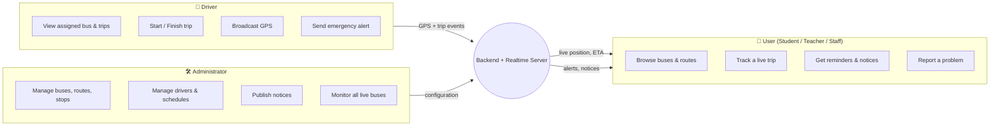
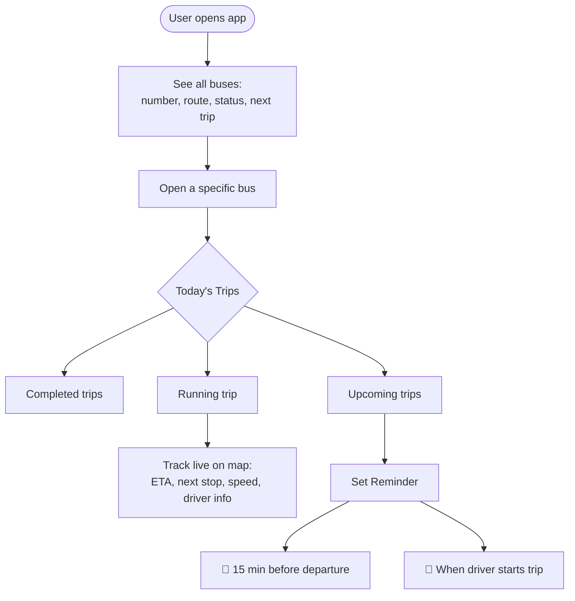
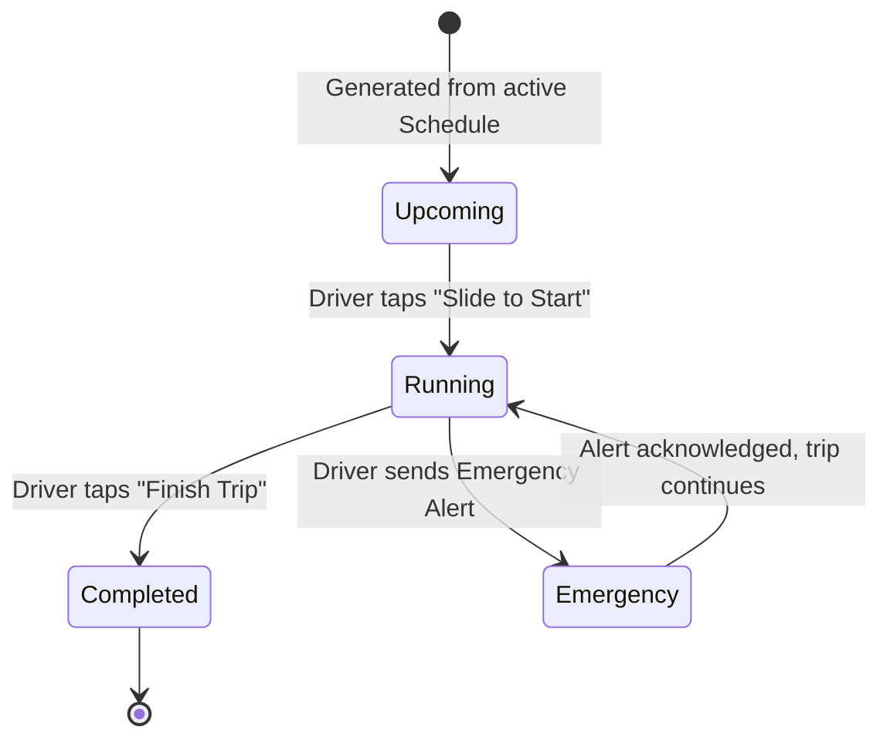
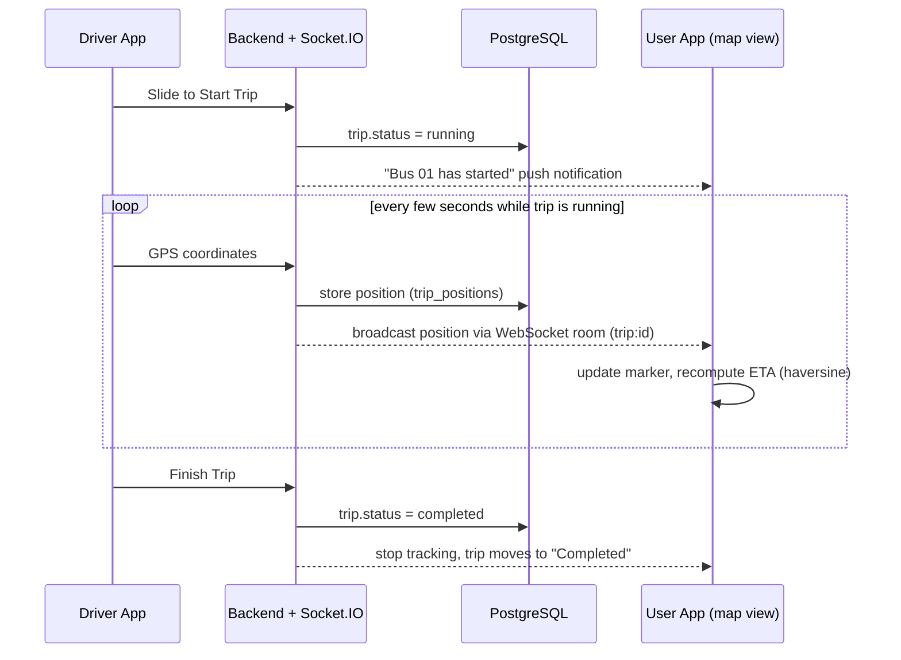
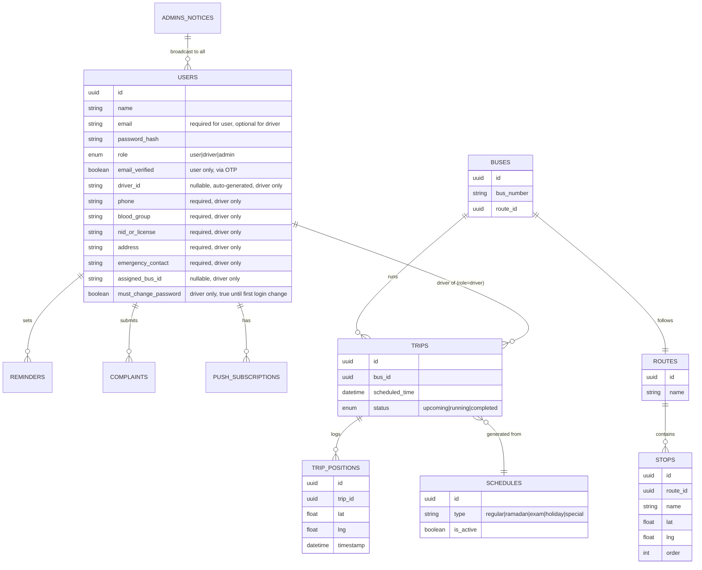
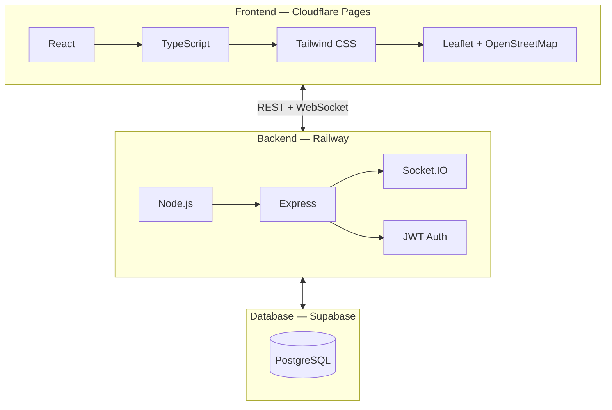

# BUBT Bus Tracking System — Project Overview

**Real-Time University Bus Tracking and Transport Management System**

This document is a high-level orientation report — it exists so you can see the whole shape of the system before we start the formal phased development process (Phase 0 onward). It is not the final specification; formal docs (`README.md`, `PROJECT_SPECIFICATION.md`, etc.) are produced in Phase 1.

---

## 1. System at a Glance

Three roles, one shared platform:

---

## 2. Core Business Concept: Trip-Based Tracking (not bus-ownership)

Users don't belong to a bus — they pick **which trip** to track, on demand.

---

## 3. Trip Lifecycle (state machine)

*Trips are never auto-completed by GPS — only a manual driver action ends a trip (confirmed decision).*

---

## 4. Real-Time Location Flow

---

## 5. High-Level Data Model (conceptual — full ER diagram comes in Phase 3)

---

## 6. Confirmed Architectural Decisions (from planning discussion)

| Decision Point | Chosen Approach |
|---|---|
| Auth model | Single `users` table with a `role` enum (`user` / `driver` / `admin`), one JWT scheme |
| Trip completion | Manual only — driver taps "Finish Trip" (no GPS auto-complete) |
| ETA calculation | Haversine distance ÷ average speed — no external routing API |
| Emergency alert recipients | Admin dashboard **and** broadcast to all users |
| Complaint/report workflow | Simple submission list for admin (no status states, no replies) |
| Notice targeting | Broadcast to all users (no per-bus/route targeting) |
| Push notifications | Web Push via service worker (PWA-style) |
| Scope | Single institution (BUBT only), no multi-tenant design |
| Offline GPS handling | Driver app caches GPS points locally when signal drops, flushes queued points to server on reconnect |
| Nearest-stop detection | Auto-detected via browser geolocation, used as default ETA reference (user can still override manually) |
| Stuck/abandoned trip recovery | Not built in v1 — accepted as a rare edge case; trip simply stays "running" until driver finishes it |
| Auth token strategy | Short-lived JWT access token + refresh token (not one long-lived token) |
| Login rate limiting | Enabled on the login endpoint to blunt brute-force attempts |
| CORS policy | Locked to the exact Cloudflare Pages production domain |
| `trip_positions` retention | Raw GPS rows auto-purged after 30 days; trip start/end summaries kept indefinitely |
| Timestamp storage | All timestamps stored in UTC in Postgres, converted to Bangladesh time (UTC+6) at the display layer |
| PWA install prompt | Shown after first login to improve iOS Web Push adoption ("Install this app for notifications") |
| Email verification method | OTP (6-digit code, 10-min expiry, single-use, resend rate-limited to 1/60s) — not a verification link |
| Driver required fields | Name, Phone, Blood Group, NID/License Number, Address, Emergency Contact, Assigned Bus are all **required**; Email and Photo remain optional |
| Driver password policy | Admin sets an initial temporary password at creation; driver is forced to change it on first login |
| Admin provisioning (v1) | No "add admin" UI — two fixed accounts inserted via DB seed script at setup time (see `ACTOR_AUTH_AND_CREDENTIALS.pdf`) |
| UI reference screenshot | Used for color/style reference only (primary blue, white cards, rounded corners) — its content ("Your Assigned Bus") does **not** reflect real business logic |

---

## 7. Actor Authentication & Provisioning Flow

Full detail lives in `ACTOR_AUTH_AND_CREDENTIALS.pdf`; summarized here for context.

```mermaid
flowchart TD
    subgraph UserFlow["User (self-service)"]
        U1[Register: name, email, password] --> U2[Account created: unverified]
        U2 --> U3[6-digit OTP sent to email]
        U3 --> U4{Correct OTP\nwithin 10 min?}
        U4 -- yes --> U5[Account verified\nlogin enabled]
        U4 -- no / expired --> U6[Resend OTP\nmax 1 per 60s]
        U6 --> U3
    end

    subgraph DriverFlow["Driver (admin-provisioned)"]
        D1[Admin fills driver profile:\nname, phone, blood group,\nNID/license, address,\nemergency contact, assigned bus] --> D2[System generates\nDriver ID + temp password]
        D2 --> D3[Admin shares credentials\nwith driver]
        D3 --> D4[Driver logs in]
        D4 --> D5[Forced password change\non first login]
    end

    subgraph AdminFlow["Administrator (fixed seed, v1)"]
        A1[Two accounts inserted\nvia DB seed script] --> A2[Login with Admin ID + password]
        A2 --> A3[⚠ Must rotate seed\npasswords before production]
    end
```

| Actor | Self-Register? | Login ID | Provisioned By | Verification |
|---|---|---|---|---|
| User | Yes | Email | Self | OTP (email, 6-digit) |
| Driver | No | Driver ID | Administrator | None needed — Admin-created is trusted |
| Administrator | No | Admin ID | Fixed DB seed (v1) | None — pre-verified seed accounts |

---

## 8. Tech Stack Summary

---

## 9. Feature → Technology Mapping

Exactly what powers each feature — no external paid services beyond hosting.

| Feature | Technology / Approach | Notes |
|---|---|---|
| **Authentication** | JWT (access token), `bcrypt` for password hashing | Single `users` table, `role` enum. No third-party auth provider (no Auth0/Firebase). |
| **Database** | PostgreSQL, hosted on **Supabase** | Accessed via Prisma ORM (planned) from the Node/Express backend. |
| **Real-time GPS broadcast** | **Socket.IO** (WebSocket) | Driver emits position → server relays to a Socket.IO "room" per `trip_id` → all subscribed users in that room receive it live. No third-party realtime service (no Pusher/Ably). |
| **Position history storage** | PostgreSQL table `trip_positions` | Written on a debounce (e.g. every ~10s), not on every raw GPS tick, to avoid DB bloat — full-frequency updates still broadcast live over the socket. |
| **Maps rendering** | **Leaflet.js** + **OpenStreetMap** tiles | No Google Maps API key, no billing. |
| **ETA calculation** | Haversine formula (great-circle distance) ÷ configurable average speed | Computed client-side or server-side from live GPS + stop coordinates. No routing API (no OSRM/Mapbox/Google Directions) — confirmed decision, trades accuracy for zero cost/infra. |
| **Push notifications (reminders, trip-start, notices, emergency)** | **Web Push API** via a browser Service Worker, using the `web-push` npm package + VAPID keys on the backend | Works on Android/desktop Chrome/Firefox/Edge natively. |
| **iOS Safari fallback** | In-app notification bell (in-app table `notifications`, polled or pushed via the existing Socket.IO connection) | Covers users who haven't installed the PWA to home screen (a requirement for iOS web push). |
| **Reminders (T-15 min)** | Backend cron/scheduled job (e.g. `node-cron`) checking upcoming trips every minute | Triggers a Web Push + in-app notification when a reminder crosses its 15-minute window. |
| **"Call Driver"** | Backend-generated `tel:` link per request (not a raw number sitting in frontend page data) | Small privacy improvement — number never appears in client-side HTML/JS bundle at rest. |
| **File/image storage** | None required for v1 | No user avatars, bus photos, or complaint attachments specified — flagging in case you want this added. |
| **Frontend hosting** | Cloudflare Pages | Static React build + service worker. |
| **Backend hosting** | Railway | Node/Express + Socket.IO server (must support persistent WebSocket connections — confirmed Railway does). |
| **Database hosting** | Supabase (managed PostgreSQL) | Also usable later for Supabase Auth/Storage if scope grows, but not used that way in this plan — we're using our own JWT auth, not Supabase Auth. |
| **API style** | REST (Express routes) for CRUD; Socket.IO for live/streaming data | No GraphQL. |
| **Validation** | Backend request validation via a schema library (e.g. `zod`) | To be finalized in Phase 2. |
| **Schedule switching (Regular/Ramadan/Exam/etc.)** | PostgreSQL-driven: `schedules` table + `schedule_trip_templates`; activating a schedule regenerates that day's `trips` rows | Pure DB logic, no external service. |

---

## 10. Development Roadmap (13 phases, gated by your approval)

```mermaid
flowchart LR
    P0[Phase 0\nAnalysis] --> P1[Phase 1\nPlanning Docs]
    P1 --> P2[Phase 2\nArchitecture]
    P2 --> P3[Phase 3\nDatabase Design]
    P3 --> P4[Phase 4\nAPI Design]
    P4 --> P5[Phase 5\nUI/UX Planning]
    P5 --> P6[Phase 6\nProject Setup]
    P6 --> P7[Phase 7\nFrontend Dev]
    P7 --> P8[Phase 8\nBackend Dev]
    P8 --> P9[Phase 9\nReal-Time System]
    P9 --> P10[Phase 10\nNotifications]
    P10 --> P11[Phase 11\nTesting]
    P11 --> P12[Phase 12\nDeployment]
```

Each phase stops for your explicit approval before the next begins. No phase is skipped or merged.

---

*Phase 0 (Analysis) is complete — gaps identified, resolved, and logged in section 6 and 7. Companion document: `ACTOR_AUTH_AND_CREDENTIALS.pdf` (full field lists, seed admin credentials, OTP flow detail). Next: Phase 1 — Planning Docs (README, PROJECT_SPECIFICATION, FEATURES, USER_FLOW, ROADMAP, PROJECT_RULES, TECH_STACK), pending your approval.*
