# UI/UX Planning — BUBT Bus Tracking System

Phase 5 output. Planning and design-system definition only — no components are built yet (that's Phase 7). The color/style reference screenshot shared earlier informs §6 below; its _content_ ("Your Assigned Bus") was explicitly excluded per the earlier decision — only its visual language is used.

---

## 1. Complete Screen List

### User (Student/Teacher/Staff)

1. Splash / Loading
2. Register
3. Verify OTP
4. Login
5. Forgot Password
6. Home (bus list + favorites + quick stats)
7. Bus Search
8. Bus Detail (Today's Trips: Completed/Running/Upcoming)
9. Live Trip Tracking (map view)
10. Notices List
11. Notice Detail
12. Report a Problem (form)
13. Notifications (in-app bell list)
14. Profile
15. Edit Profile
16. Change Password
17. Install-App Prompt (iOS push onboarding)

### Driver

18. Driver Login
19. Forced Password Change (first login)
20. Driver Home (Today's Bus, Route, Trips)
21. Active Trip Screen (Slide to Start / GPS live / Finish Trip / Emergency Alert)
22. Driver Profile (read-only view)

### Administrator

23. Admin Login
24. Admin Dashboard (fleet-wide live map + summary stats)
25. Manage Buses (list/create/edit)
26. Manage Routes & Stops (list/create/edit)
27. Manage Drivers (list/create/edit/reset password/activate-deactivate)
28. Manage Schedules (list/create/edit templates/activate)
29. Manage Notices (list/create/edit/delete)
30. View Complaints (list)
31. Emergency Alerts Log

**Total: 31 screens** across three roles.

---

## 2. Navigation Structure

### User — bottom tab bar (5 tabs, matches the reference screenshot's pattern)

`Home · Track · Notices · Routine (reminders) · Profile`

### Driver — simplified single-focus nav

No tab bar — driver app is intentionally single-screen-per-context (Home → Active Trip), minimizing distraction while driving. A top-corner icon accesses Profile.

### Admin — sidebar nav (desktop-first, since transport office staff work at a desk)

`Dashboard · Buses · Routes & Stops · Drivers · Schedules · Notices · Complaints · Alerts`

```mermaid
flowchart TD
    subgraph UserNav["User — Bottom Tabs"]
        UH[Home] --- UT[Track]
        UT --- UN[Notices]
        UN --- UR[Routine]
        UR --- UP[Profile]
    end
    subgraph DriverNav["Driver — Single Focus"]
        DH[Driver Home] --> DA[Active Trip]
        DA --> DH
    end
    subgraph AdminNav["Admin — Sidebar"]
        AD[Dashboard] --- AB[Buses]
        AB --- AR[Routes/Stops]
        AR --- ADR[Drivers]
        ADR --- AS[Schedules]
        AS --- ANO[Notices]
        ANO --- AC[Complaints]
        AC --- AE[Alerts]
    end
```

---

## 3. Journeys

Full step-by-step journeys already documented in `USER_FLOW.md` (registration/OTP, trip tracking, reminders, driver trip lifecycle, admin fleet setup). This phase maps those flows onto the screen list above rather than re-deriving them — see `USER_FLOW.md` §1–3 for the authoritative sequences.

**Click-depth check against the "≤2 clicks to track a bus" design principle:**
Home (tap) → Bus Detail (tap) → Running Trip auto-opens map = **2 taps**. ✅ Meets the constraint.

---

## 4. Reusable Components

Built once in `apps/frontend/src/components/`, used everywhere — no duplicated markup (per `PROJECT_RULES.md`).

| Component                                                       | Used In                                               |
| --------------------------------------------------------------- | ----------------------------------------------------- |
| `Button` (primary/secondary/danger variants)                    | Everywhere                                            |
| `Card`                                                          | Bus list items, notice items, stat tiles              |
| `StatusBadge` (Running/Upcoming/Completed/Active/Inactive)      | Bus list, trip list, driver list                      |
| `MapView` (Leaflet wrapper)                                     | Live tracking, admin dashboard                        |
| `BottomTabBar`                                                  | User app shell                                        |
| `Sidebar`                                                       | Admin app shell                                       |
| `Modal` / `Sheet`                                               | Confirmations (finish trip, deactivate driver), forms |
| `FormField` (input/select/textarea wrapper w/ validation state) | All forms                                             |
| `OTPInput`                                                      | OTP verification screen                               |
| `SlideToConfirm`                                                | Driver "Slide to Start Trip"                          |
| `Toast`                                                         | Success/error feedback                                |
| `EmptyState`                                                    | No buses/notices/complaints yet                       |
| `Avatar`                                                        | Profile, driver cards                                 |
| `NotificationBell` (with unread badge)                          | User header                                           |
| `DataTable`                                                     | Admin list screens (drivers, buses, complaints)       |

---

## 5. Typography

- **Typeface:** Inter (or system font stack fallback: `-apple-system, Segoe UI, Roboto, sans-serif`) — clean, highly legible at small sizes, matches the modern/minimal principle.
- **Scale:**

| Token        | Size | Weight | Use                                            |
| ------------ | ---- | ------ | ---------------------------------------------- |
| `display`    | 28px | 700    | Greeting headline ("Good Evening, [Name]")     |
| `h1`         | 22px | 700    | Screen titles                                  |
| `h2`         | 18px | 600    | Section headers                                |
| `body`       | 14px | 400    | Default text                                   |
| `bodyStrong` | 14px | 600    | Emphasized inline text (bus number, ETA value) |
| `caption`    | 12px | 400    | Secondary/meta text (timestamps, labels)       |
| `badge`      | 11px | 600    | Status pill text                               |

---

## 6. Color Palette

Derived from the reference screenshot's visual language (color/style only, as agreed):

| Token                       | Hex       | Use                                      |
| --------------------------- | --------- | ---------------------------------------- |
| `primary`                   | `#2563EB` | Primary actions, header gradients, links |
| `primaryDark`               | `#1D4ED8` | Gradient end, pressed states             |
| `success` (Running)         | `#16A34A` | "Running" status badge                   |
| `warning` (Upcoming)        | `#D97706` | "Upcoming" status badge                  |
| `neutral` (Completed)       | `#64748B` | "Completed" status badge                 |
| `danger` (Emergency/Urgent) | `#DC2626` | Emergency alerts, urgent notice tag      |
| `surface`                   | `#FFFFFF` | Card backgrounds                         |
| `background`                | `#F8FAFC` | App background                           |
| `border`                    | `#E2E8F0` | Card borders, dividers                   |
| `textPrimary`               | `#0F172A` | Primary text                             |
| `textSecondary`             | `#475569` | Secondary/caption text                   |

**Style language:** white cards with soft shadows, rounded corners (`12px` radius standard, `20px` on hero/greeting cards), pill-shaped status badges — consistent with the reference screenshot's aesthetic.

---

## 7. Iconography

`lucide-react` icon set — consistent line-icon style, matches the reference screenshot's icon weight. Core icons needed: bus, map-pin, clock, bell, phone, user, shield (admin), navigation/route, alert-triangle (emergency), calendar, check-circle, search.

---

## 8. Spacing System

4px base unit, standard Tailwind-compatible scale:

| Token | Value |
| ----- | ----- |
| `xs`  | 4px   |
| `sm`  | 8px   |
| `md`  | 16px  |
| `lg`  | 24px  |
| `xl`  | 32px  |
| `2xl` | 48px  |

Card internal padding: `16px`. Screen horizontal padding: `16px`. Gap between stacked cards: `12px`.

---

## 9. Responsive Breakpoints

Mobile-first — the User and Driver apps are primarily used on phones (matches the reference screenshot's mobile layout); Admin is desktop-first (transport office use case).

| Breakpoint | Width      | Primary target                                                               |
| ---------- | ---------- | ---------------------------------------------------------------------------- |
| `mobile`   | 0–639px    | User & Driver apps (default)                                                 |
| `tablet`   | 640–1023px | User app on tablet, Admin on smaller laptops                                 |
| `desktop`  | 1024px+    | Admin dashboard (default), User app scales up to a centered max-width column |

User/Driver screens never exceed a `480px` centered column even on wider viewports — reinforces the "phone app" feel rather than stretching into an awkward wide layout.

---

## Phase 5 Checklist

- [x] Complete screen list (31 screens across 3 roles)
- [x] Navigation flow (bottom tabs for User, single-focus for Driver, sidebar for Admin)
- [x] User/Driver/Admin journeys (mapped onto screens; detailed steps remain in `USER_FLOW.md`)
- [x] Reusable components list (15 components)
- [x] Theme (color palette, derived from the approved style reference)
- [x] Typography scale
- [x] Iconography (lucide-react)
- [x] Spacing system
- [x] Responsive breakpoints

No implementation performed. Waiting for approval to proceed to **Phase 6 — Project Setup**.
