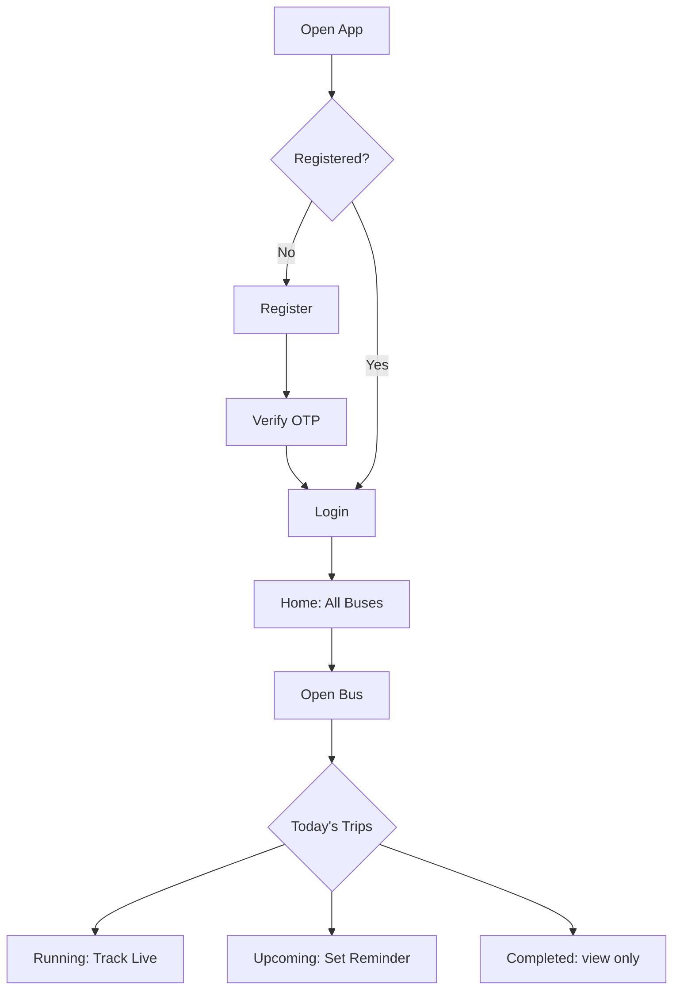
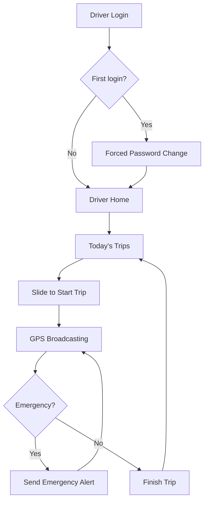
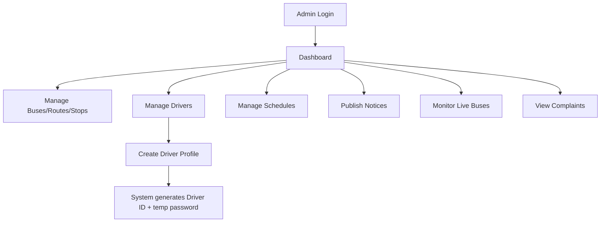

# User Flow — BUBT Bus Tracking System

## 1. User Journey

### 1.1 Onboarding
1. Open app → Register (name, email, password, optional designation/ID)
2. Receive 6-digit OTP via email (valid 10 min)
3. Enter OTP → account verified → redirected to login
4. Login with email + password

### 1.2 Daily Use — Tracking a Bus
1. Land on Home → see list of all buses (number, route, status, next trip)
2. Search or scroll to find a bus → open bus detail
3. See Today's Trips: Completed / Running / Upcoming
4. Tap the running trip (or an upcoming one) → map view opens
5. See live position, ETA to nearest/selected stop, next stop, driver info
6. Optionally tap "Call Driver"

*Target: reachable in ≤2 clicks from Home.*

### 1.3 Setting a Reminder
1. Open an upcoming trip → tap "Set Reminder"
2. Receive push notification 15 min before departure
3. Receive push notification the moment the driver starts the trip

### 1.4 Notices & Support
1. View Notices tab → browse by category
2. Report a Problem → simple form submission → confirmation

---

## 2. Driver Journey

### 2.1 Login
1. Receive Driver ID + temporary password from Admin
2. Login → forced password change (first login only)
3. Land on Driver Home: Today's Bus, Route, Trips

### 2.2 Running a Trip
1. Before departure: tap "Slide to Start Trip"
2. GPS sharing begins automatically; subscribed users notified
3. During trip: GPS pings sent continuously (cached locally if offline, flushed on reconnect)
4. If needed: "Send Emergency Alert" → broadcasts to Admin + all users
5. On arrival: tap "Finish Trip" (manual only — ends tracking for that trip)

---

## 3. Administrator Journey

### 3.1 Fleet Setup (one-time / ongoing)
1. Login with fixed seed Admin ID + password
2. Create Buses → assign Routes → define Stops
3. Create Driver profiles (full required field set) → system generates Driver ID + temp password → share with driver
4. Define Schedules (Regular, Ramadan, Exam, Holiday, Special) → activate one

### 3.2 Daily Operations
1. Monitor live bus locations on dashboard
2. Publish notices as needed (category-tagged)
3. Review submitted complaints (list view)
4. Respond to Emergency Alerts if received

---

## 4. Cross-Actor Flow: Live Tracking (system-level)

See `PROJECT_OVERVIEW.md` §4 for the full sequence diagram (Driver GPS → Backend → DB → Socket.IO → User map).
