# Roadmap — BUBT Bus Tracking System

Every phase requires explicit approval before the next begins. No phase is skipped or merged.

| Phase | Name | Output | Status |
|---|---|---|---|
| 0 | Analysis | Gap analysis, clarifying questions, resolved decisions | ✅ Complete |
| 1 | Planning Docs | README, PROJECT_SPECIFICATION, FEATURES, USER_FLOW, ROADMAP, PROJECT_RULES, TECH_STACK | ✅ Complete |
| 2 | System Architecture | Folder structure, frontend/backend/DB/API architecture, auth flow, real-time flow, deployment flow | ✅ Complete |
| 3 | Database Design | ER diagram, tables, relationships, indexes, constraints, seed data plan, SQL schema | ✅ Complete |
| 4 | API Design | Full REST API documentation (all endpoints, request/response formats, error handling) | ✅ Complete |
| 5 | UI/UX Planning | Screen list, navigation flow, journeys, reusable components, theme/color/typography/spacing | ✅ Complete |
| 6 | Project Setup | Git repo, frontend/backend/DB init, dependencies, linting/formatting, first commit | ✅ Complete |
| 7 | Frontend Development | Auth, User module, Driver module, Admin module (mock data, no backend) | ✅ Complete |
| 8 | Backend Development | Auth, DB, REST APIs, validation, RBAC, JWT, PostgreSQL connection | ✅ Complete |
| 9 | Real-Time System | Socket.IO, driver GPS, live tracking, trip status updates | ✅ Complete |
| 10 | Notification System | Trip started, reminder, delay, cancellation, schedule change, emergency | ✅ Complete |
| 11 | Testing | Unit, integration, UI, performance testing; bug fixes | ⬜ Not Started |
| 12 | Deployment | Frontend → Cloudflare Pages, Backend → Railway, DB → Supabase, production verification | ⬜ Not Started |

```mermaid
flowchart LR
    P0[0. Analysis ✅] --> P1[1. Planning Docs ✅]
    P1 --> P2[2. Architecture ✅]
    P2 --> P3[3. Database Design ✅]
    P3 --> P4[4. API Design ✅]
    P4 --> P5[5. UI/UX Planning ✅]
    P5 --> P6[6. Project Setup ✅]
    P6 --> P7[7. Frontend Dev ✅]
    P7 --> P8[8. Backend Dev ✅]
    P8 --> P9[9. Real-Time System ✅]
    P9 --> P10[10. Notifications ✅]
    P10 --> P11[11. Testing]
    P11 --> P12[12. Deployment]
```

## Approval Log

| Phase | Approved On | Notes |
|---|---|---|
| 0 | — | Gaps resolved via Q&A; all decisions logged in PROJECT_OVERVIEW.md |
| 1 | — | 7 planning docs approved; favorite-bus feature added post-approval via review comment |
| 2 | — | ARCHITECTURE.md approved |
| 3 | — | DATABASE_DESIGN.md + schema.sql approved; day_group model added for real Sun-Thu/Friday schedule variation |
| 4 | — | API_DESIGN.md approved |
| 5 | — | UI_UX_PLANNING.md approved |
| 6 | — | Monorepo scaffold committed (`640da6b`); class diagram added (`0d48b0c`) |
| 7 | — | 4 modules, 4 commits: Auth (`e21d857`), User (`7340e45`), Driver (`5417587`), Admin (`cc6bd75`) |
| 8 | — | Full backend implementation committed (`b6e4636`) — see docs/SETUP_NOTES.md for verification approach and limits |
| 9 | — | Socket.IO real-time system committed (`270ea4b`) — server-side verified with a genuine socket integration test (7/7); known limitation: sockets not yet JWT-authenticated, flagged for Phase 11 |
| 10 | *(pending)* | Notification system committed (`9a79c69`) — verified with a runtime reminder-check test (7/7); known limitation: frontend push subscription registration will 401 until real session wiring lands |
